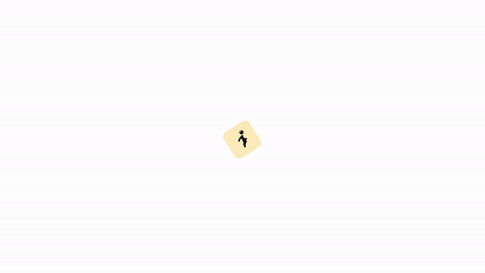

<p align="center">
  <h1 align="center">CoMo: Controllable Motion Generation<br> through Language Guided Pose Code Editing</h1>
  <h3 align="center">ECCV 2024</h3>
  <h3 align="center"><a href="https://arxiv.org/abs/2403.13900">Paper</a> | <a href="https://yh2371.github.io/como/">Project Page</a> </h3>
  <div align="center"></div>
</p>

<div float="center">
  
</div>

## ToDos

- [ ] Release motion editing demo.

- [x] Release finegrained keyword data.

- [x] Release training/evaluation code. 

## Installation

To get started, clone this project, then setup the required dependencies using the following commands:

```bash
conda env create -f environment.yml
conda activate como
bash dataset/prepare/download_glove.sh
bash dataset/prepare/download_extractor.sh
```

The code was tested on Ubuntu 22.04.4 LTS.

## Data

### Motion-Language Data

For the HumanML3D and KIT-ML datasets, please follow find the instructions for downloading and preprocessing [[here]](https://github.com/EricGuo5513/HumanML3D).   

The resulting file directory should look like this:  
```
./dataset/[dataset_name]/
├── new_joint_vecs/
├── new_joints/
├── texts/
├── Mean.npy 
├── Std.npy 
├── train.txt
├── val.txt
├── test.txt
├── train_val.txt
└── all.txt
```

### Fine-grained Descriptions

We prompt GPT-4 to obtain fine-grained keywords that describe the motion of different body parts. The collected keywords and corresponding CLIP embeddings can be downloaded using the following commands:

```bash
bash dataset/prepare/download_keywords.sh
```

The keywords and keyword embeddings will be stored in the `./keywords` and `./keyword_embeddings` sub-folders, respectively, for each dataset `./dataset/[dataset_name]/`. The training/evaluation code directly loads keyword embeddings. The original text is stored in dictionaries and can be read as follows: 

```bash
text = np.load("./dataset/[dataset_name]/keywords/[file_id].npy", allow_pickle = True).item()
```

### Pose Codes

We adapt [[PoseScript]](https://github.com/EricGuo5513/HumanML3D) to parse poses into pose codes, the parsed codes will be stored in the `./codes` sub-folder for each dataset `./dataset/[dataset_name]/`:

```bash
bash dataset/prepare/parse_motion.sh
```

Although we chose to obtain pose codes through heuristic skeleton parsing throughout our framework, it is also possible to train an encoder module using the parsed pose codes as latent supervision to encode motion sequences into pose code sequences. We include the checkpoint and training details for this encoder in the sections below.

### Pre-trained Models 

The pretrained model checkpoints will be stored in the `./pretrained` folder:

```bash
bash dataset/prepare/download_model.sh
```

## Training

### Motion Decoder 

```bash
python train_dec.py \
--batch-size 256 \
--lr 1e-4 \
--total-iter 300000 \
--lr-scheduler 200000 \
--nb-code 392 \
--down-t 2 \
--depth 3 \
--dilation-growth-rate 3 \
--out-dir output \
--dataname t2m \
--vq-act relu \
--loss-vel 0.5 \
--recons-loss l1_smooth \
--exp-name Dec \
--output-emb-width 392
```

### [Optional] Motion Encoder

```bash
python train_enc.py \
--batch-size 256 \
--lr 1e-4 \
--total-iter 300000 \
--lr-scheduler 200000 \
--nb-code 392 \
--down-t 2 \
--depth 3 \
--dilation-growth-rate 3 \
--out-dir output \
--dataname t2m \
--vq-act relu \
--loss-vel 0.5 \
--recons-loss l1_smooth \
--exp-name Enc \
--output-emb-width 392 \
--resume-pth ./pretrained/Dec/net_best_fid.pth
```

### Motion Generator

```bash
python train_t2m.py \
--exp-name Trans \
--batch-size 64 \
--num-layers 9 \ 
--nb-code 392 \
--n-head-gpt 16 \ 
--block-size 62 \
--ff-rate 4 \ 
--out-dir output \
--total-iter 300000 \
--lr-scheduler 150000 \
--lr 0.0001 \
--dataname t2m \
--down-t 2 \
--depth 3 \
--eval-iter 10000 \
--dilation-growth-rate 3 \
--output-emb-width 392 \
--resume-pth ./pretrained/Dec/net_best_fid.pth \
--resume-trans ./output/GPT/net_best_fid.pth 
```

## Evaluation

### Motion Decoder

```bash
python eval_dec.py \
--batch-size 256 \
--lr 2e-4 \
--total-iter 300000 \
--lr-scheduler 200000 \
--nb-code 392 \
--down-t 2 \
--depth 3 \
--dilation-growth-rate 3 \
--out-dir output \
--dataname t2m \
--vq-act relu \
--loss-vel 0.5 \
--recons-loss l1_smooth \
--exp-name TEST_Dec \
--resume-pth ./pretrained/Dec/net_best_fid.pth \
--output-emb-width 392
```

### Motion Generator

```bash
python eval_t2m.py  \
--exp-name TEST_Trans \
--batch-size 256 \
--num-layers 9 \
--embed-dim-gpt 1024 \
--nb-code 392 \
--n-head-gpt 16 \
--block-size 62 \
--ff-rate 4 \
--drop-out-rate 0.1 \
--resume-pth ./pretrained/Dec/net_best_fid.pth \
--vq-name VQVAE \
--out-dir output \
--total-iter 300000 \
--lr-scheduler 150000 \
--lr 0.0001 \
--dtaname t2m \
--down-t 2 \
--depth 3 \
--eval-iter 10000 \
--pkeep 0.5 \
--dilation-growth-rate 3 \
--vq-act relu \
--output-emb-width 392 \
--resume-trans ./pretrained/Trans/net_best_fid.pth
```

## BibTeX
If you find our work helpful or use our code, please consider citing:
```bibtex
@misc{huang2024como,
      title={CoMo: Controllable Motion Generation through Language Guided Pose Code Editing}, 
      author={Yiming Huang and Weilin Wan and Yue Yang and Chris Callison-Burch and Mark Yatskar and Lingjie Liu},
      year={2024},
      eprint={2403.13900},
      archivePrefix={arXiv},
      primaryClass={cs.CV}
}
```

## Acknowledgement

We would like to thank the following contributors whose amazing work our code is based on:

[text-to-motion](https://github.com/EricGuo5513/text-to-motion), [T2M-GPT](https://github.com/Mael-zys/T2M-GPT), [PoseScript](https://github.com/naver/posescript)
